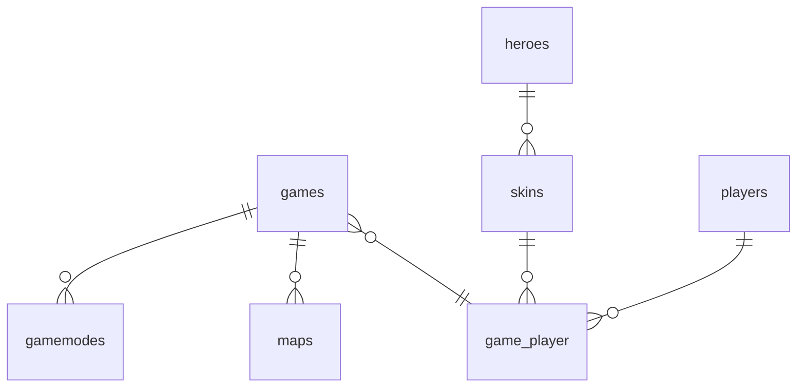

# OverWatch DB

This project was developed within the framework of vocational school for database teaching. The project creates a database based on the computer game, which can be managed with a rudimentary UI.

For the use of a PHP debug server a "router.php" is included, which allows to use the project as intended.

**This project is in no case intended for productive use.**

## Requirements

- PHP >= 7.4
- php_mysqli

## Database Structure

